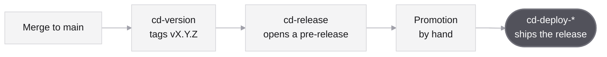

<p align="center">
  <picture>
    <source media="(prefers-color-scheme: dark)" srcset=".brand/banner-dark.svg">
    
  </picture>
</p>

<p align="center">
  <a href="LICENSE.md"></a>
</p>

##  What’s inside

| Part | File | Does |
|---|---|---|
| **Workflows** | [`cd-version`](.github/workflows/cd-version.yaml) | Tags each merge to `main`; the branch prefix sets the bump |
| | [`cd-release`](.github/workflows/cd-release.yaml) | Opens the release of a tag, with its `feat` and `fix` commits as notes |
| | [`cd-deploy-npm`](.github/workflows/cd-deploy-npm.yaml) | Builds the packages and publishes them to npm |
| **Renovate** | [`default.json`](default.json) | Monthly dependency updates in the fleet’s commit format |
| **Community** | [`CONTRIBUTING.md`](CONTRIBUTING.md) | How a change reaches `main` |
| | [`SECURITY.md`](SECURITY.md) | How to report a vulnerability |
| | [`CODE_OF_CONDUCT.md`](CODE_OF_CONDUCT.md) | Contributor Covenant 3.0 |
| | [`ISSUE_TEMPLATE`](.github/ISSUE_TEMPLATE) | The bug report and feature request forms |
| | [`PULL_REQUEST_TEMPLATE.md`](.github/PULL_REQUEST_TEMPLATE.md) | The pull request checklist |

##  How it works



A repository calls these from its own `.github/workflows`, one file per stage.

> [!IMPORTANT]
> Pin an exact release, as the examples do. Releases are immutable and never retagged; Renovate opens the pull request for a newer one.

##  Workflows

### cd-version

Tags each merge to `main` with the next `vX.Y.Z`. The merged branch sets the bump: `feature/*` the minor; `fix/*`, `hotfix/*` and dependency updates the patch. What `version-command` changes is committed as `chore: Release vX.Y.Z` before the tag; without it, the merge commit itself is tagged.

```yaml
on:
  push:
    branches: [main]
jobs:
  version:
    uses: droneey/.github/.github/workflows/cd-version.yaml@v2.3.3
    permissions:
      contents: write
      pull-requests: read
    with:
      version-command: npm version --no-git-tag-version "$VERSION"
    secrets:
      token: ${{ secrets.GH_TOKEN }}
```

| Name | Default | Meaning |
|---|---|---|
| `version-command` | none | Writes `$VERSION` into the project files |
| `token` | required | A personal access token, so the tag starts other workflows |

<details>
<summary><code>version-command</code> per stack</summary>
<br>

| Stack | `version-command` |
|---|---|
| JavaScript, one package | `npm version --no-git-tag-version "$VERSION"` |
| JavaScript, workspaces | `for f in package.json packages/*/package.json; do jq --arg v "$VERSION" '.version = $v' "$f" > "$f.tmp" && mv "$f.tmp" "$f"; done` |
| Python | `uv version "$VERSION"` |
| Rust | `cargo set-version "$VERSION"` |
| Go, infrastructure | None: the tag is the version |

</details>

### cd-release

Opens the GitHub release of the pushed tag, with the `feat` and `fix` commits since the previous tag as notes; a rerun edits it. The fleet opens pre-releases and promotes them by hand. A promotion starts the deploy without a `token`; pass one only when the pre-release itself must start a workflow, such as a staging deploy on `release: prereleased`.

```yaml
on:
  push:
    tags: ['v*']
jobs:
  pre-release:
    uses: droneey/.github/.github/workflows/cd-release.yaml@v2.3.3
    permissions:
      contents: write
    with:
      prerelease: true
```

| Name | Default | Meaning |
|---|---|---|
| `prerelease` | `false` | Opens a pre-release, to be promoted by hand |
| `assets-command` | none | Builds, from the tag, the files named in `assets` |
| `assets` | none | Space-separated files attached when the release opens, replaced on a rerun |
| `token` | `GITHUB_TOKEN` | A personal access token, so the release starts other workflows |

A release that carries files builds and attaches them as it opens, so it never exists without them:

```yaml
    with:
      prerelease: true
      assets-command: tar -czf configs.tar.gz -C packages common && sha256sum configs.tar.gz > configs.tar.gz.sha256
      assets: configs.tar.gz configs.tar.gz.sha256
```

### cd-deploy-npm

A `cd-deploy-<target>` workflow ships a promoted release, and a repository’s `cd-deploy.yaml` calls the one it needs. This one builds every matched package that has a `build` script and publishes every one that is not `private`. Without a token it uses npm’s trusted publishing, so there is no secret to leak or expire; a version already on the registry is skipped.

```yaml
on:
  release:
    types: [released]
jobs:
  deploy:
    uses: droneey/.github/.github/workflows/cd-deploy-npm.yaml@v2.3.3
    permissions:
      contents: read
      id-token: write
```

| Name | Default | Meaning |
|---|---|---|
| `packages` | `package.json` | Space-separated globs of the `package.json` files to publish |
| `node-version` | `24` | The Node that publishes; trusted publishing needs npm 11.5.1 or newer |
| `npm_token` | none | A publish token, for a registry without trusted publishing |

> [!NOTE]
> Each package on npmjs.com names its trusted publisher: GitHub Actions, organisation `droneey`, its repository and the calling workflow, `cd-deploy.yaml`, with no environment. A new package is published once by hand, then gets the same.

##  Renovate

`default.json` is the fleet’s preset. On the first day of each month, 10:00–18:00 Warsaw time, it opens one pull request for the minor and patch updates and one per major, and refreshes the lockfile; commits read `chore: Update …` and ranges are bumped. Security updates skip the schedule, and the Dependency Dashboard issue starts any update on demand.

A repository opts in with its `renovate.json`:

```json
{
  "$schema": "https://docs.renovatebot.com/renovate-schema.json",
  "extends": ["github>droneey/.github"]
}
```

`renovate-config.json` hands the same preset to every repository Renovate onboards. The Renovate app is installed once, on the organisation.

##  Community files

Every repository without its own copy uses these: as tabs beside its README, and as its issue forms and pull request template. A file of the same name in the repository replaces the default, and any file in its own `.github/ISSUE_TEMPLATE` replaces every form.

`SECURITY.md` sends reports to GitHub’s private vulnerability reporting, which has to be on in each public repository.

<details>
<summary><b>Development</b></summary>
<br>

```bash
mise install    # the tools, devkit's archive as .devkit, the git hooks
mise run check  # actionlint, betterleaks, ls-lint
```

| Convention | Rule |
|---|---|
| Branch | `feature/<taskId>-<name>`, `fix/…` or `hotfix/…` |
| Commit | One line: `type: Subject` |
| Check | `actionlint`, the same as CI |
| Workflow | A new input or secret gets its row in this README |
| Community file | True for every repository, with nothing specific to this one |
| Release | Every merge tags the next version; nothing is retagged |

</details>
